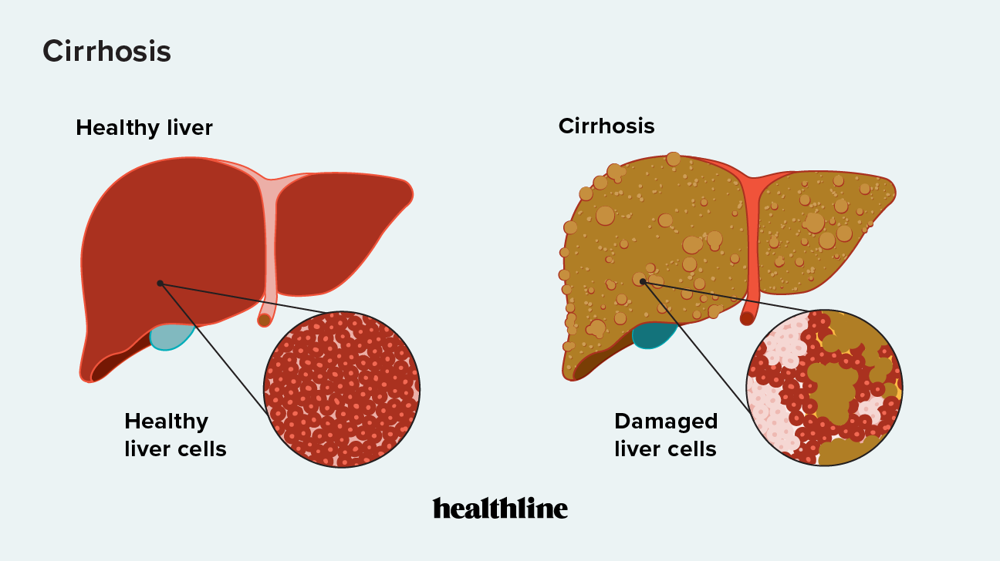

# Prediction of Cirrhosis Outcomes

## Overview
This repository contains my solution for the [Kaggle challenge](https://www.kaggle.com/competitions/playground-series-s3e26/overview) aimed at predicting the outcomes of patients with liver cirrhosis. I placed in the top 15%.

## Data Description
The dataset used in this project consists of 17 clinical features (e.g. such as age, sex, cholesterol levels). The outcomes are categorized as follows: 0 = D (death), 1 = C (censored), and 2 = CL (censored due to liver transplantation). The full data description can be found [here](https://www.kaggle.com/datasets/joebeachcapital/cirrhosis-patient-survival-prediction).

## Project Structure
- 📂 **data:** train, test, and original data
- 📂 **figures:** data and model visualizations
- 📂 **models:** saved models
- 📂 **results**
    - **`notes.txt`:** results of each experiment
- 📂 **src**
    - 📄 **`autoencoder.py`:** tabular autoencoder for feature learning
    - 📄 **`eda.ipynb`:** notebook exploring data
    - 📄 **`logistic_regression.py`:** logistic regression classifier
    - 📄 **`xgboost_clf.py`:** XGBoost classifier
    - 📄 **`utils.py`:** util functions and shared variables
- 📄 **`requirements.txt`:** project dependencies

## Methodology
1. **Exploratory Data Analysis**
    - Explore the distribution of features, classes, and correlations between them.
3. **Baseline Results**
    - Train a logistic regression on the given training data for baseline results.
    - Negative log loss of 0.525 (10-fold)
7. **Modeling**
    - Add XGBoost classifier and Optuna hyperparameter tuning
    - Negative log loss of 0.443 (10-fold)
5. **Data Augmentation**
    - Add the original data (containing NULLs) to the training data.
    - Negative log loss of 0.438 (10-fold)
9. **Representation Learning**
    - Experiment with autoencoding the tabular features into dense latent features.
    - No improvement (need more data)

## Lessons
- Ensembling generally helps performance (all top solutions created custom ensembles).
- Representation learning has the potential to increase performance at the cost of interpretability. However, it requires a lot of data.
- If nothing else, Kaggle competitions teach the importance of validation. I climbed 155 positions on the private leaderboard simply because many people overfit to the public leaderboard.
